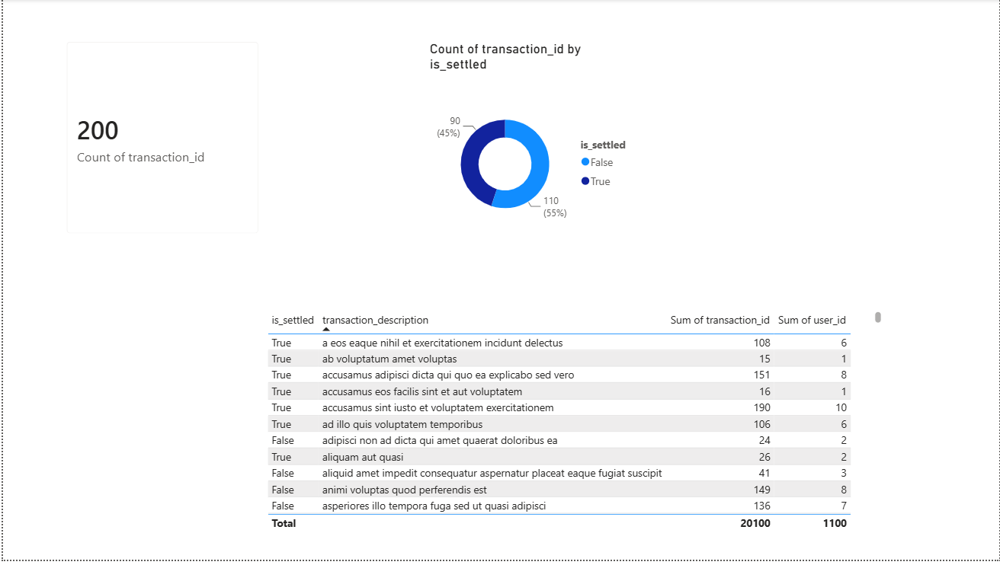

# End-to-End UK Financial Transactions Data Pipeline

## 🏆 Project Architecture & Summary
An automated, multi-tiered data engineering pipeline designed to ingest unstructured transactional logs from an upstream API endpoint, execute validation transformations, stream the normalized dataset into a cloud warehouse layer, and serve operational metrics to business intelligence suites.

Instead of running a manual script, this project simulates a resilient enterprise workflow—confronting the real-world friction of environment mismatches, cloud authentication protocols, and security governance.

---

## 🛠️ Tech Stack & Systems Architecture
* **Ingestion Core:** Python (Pandas, Requests Engine, OS Directory Management)
* **Storage Layer:** Local File-System Target Ingestion (Staging Layer / CSV Parsing)
* **Cloud Infrastructure:** Google BigQuery Data Warehouse Sandbox Environment
* **Transport Optimization:** Apache Arrow Binary Engine (`pyarrow` Columnar Stream serialization)
* **Presentation Layer:** Power BI Desktop Suite (Cloud Database Data Modeling)
* **Security & Governance:** Automated `.gitignore` configuration guarding private IAM Service Account keys (`gcp_credentials.json`)

---

## 🚰 Data Lineage Pipeline Execution Stages

```text
[Upstream JSON API] ➔ [Python ETL Script] ➔ [Local CSV Staging] ➔ [BigQuery Warehouse] ➔ [Power BI Dashboard]

1. Extraction & Local Staging (ingest_pipeline.py)
Establishes secure connection parameters with public REST API endpoints using the Python requests library.

Parses unstructured JSON arrays into localized, relational data frames.

Implements robust anomaly screening rules to deduplicate incoming data based on transaction_id.

Standardizes columns from messy API camelCase (userId, completed) into strict database snake_case (user_id, is_settled).

Automatically creates system runtime directories to write clean CSV payloads into isolated target staging zones (landing_zone/).

2. Cloud Ingestion Layer (load_to_cloud.py)
References a secure local service account payload to establish authentication parameters with Google Cloud.

Converts tabular structures into Apache Arrow memory maps via pyarrow for low-latency streaming uploads.

Streams clean staging tables directly into targeted Cloud Data Warehousing datasets (reporting_staging).

Configures overwriting rules (WRITE_TRUNCATE) to handle record initialization and safeguard state synchronization.

3. Business Intelligence & Modeling (UK_Transaction_Analytics.pbix)
Establishes a direct connection protocol between Power BI and BigQuery cloud warehouse repositories.

Models data dimensions into high-performance reporting memory tables via the Import method.

Configures executive monitoring parameters, mapping total operational volume counts, transactional settlement distributions, and a detailed transaction-level audit reporting grid.


📊 Dashboard Preview



🧠 Real Challenges Faced & Engineering Solutions
This project provided hands-on experience with the classic bottlenecks that occur when moving data between different layers of a modern stack:

The Local Path Key Vulnerability: When generating the Google Cloud IAM Service key (gcp_credentials.json), keeping it safe from public exposure was critical. I built a global .gitignore file to mask it. However, I initially misconfigured the file path using Windows backslashes (\), which Git failed to parse. Moving the file to the root workspace directory and refactoring the paths to standard Linux forward slashes (/) successfully locked the credentials safely on my local drive.

The Python Core Mismatch (ModuleNotFoundError): While launching the cloud loader script, the runtime threw an error for a missing google module. I diagnosed that VS Code's terminal runtime was targeted at a different Python environment than my global package installer. I bypassed this by targeting the environment explicitly using python -m pip install google-cloud-bigquery.

The Serialization Bottleneck: The final cloud upload stream failed due to a missing package called pyarrow. Through log troubleshooting, I discovered that BigQuery handles DataFrame inputs via highly compressed Apache Arrow columnar binaries rather than raw text arrays. Running a targeted installation for pyarrow instantly finalized the handshake protocol and authorized the data load.

---
📂 Project Directory Map
Plaintext
uk-financial-data-pipeline/
├── landing_zone/              # Local file staging layer (Hidden by .gitignore)
├── .gitignore                 # Active security shield protecting cloud credentials
├── gcp_credentials.json       # Google Service Account Key (Locked locally)
├── ingest_pipeline.py         # Stage 1: API Extraction & Pandas cleansing script
├── load_to_cloud.py           # Stage 2: Google BigQuery secure streaming script
├── UK_Transaction_Analytics.pbix # Stage 3: Power BI Data Model & Dashboard
└── dashboard_preview.png      # High-fidelity dashboard render for quick profile review

---

Author: Tanya Amber

Data Engineering & Analytics Portfolio Project (2026)